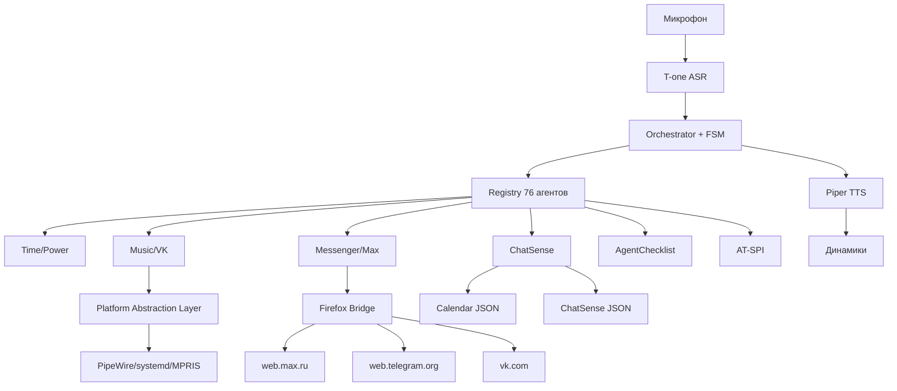
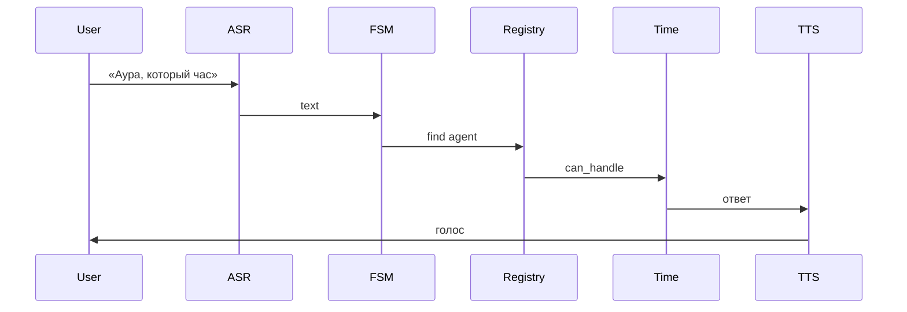

# Архитектура Aura — диаграмма

```mermaid
graph TB
    Mic[Микрофон] --> ASR[T-one ASR]
    ASR --> FSM[Orchestrator + FSM]
    FSM --> Reg[Registry 76 агентов]
    Reg --> A1[Time/Power]
    Reg --> A2[Music/VK]
    Reg --> A3[Messenger/Max]
    Reg --> A4[ChatSense]
    Reg --> A5[AgentChecklist]
    Reg --> A6[AT-SPI]
    A2 --> PAL[Platform Abstraction Layer]
    A3 --> Bridge[Firefox Bridge]
    Bridge --> Max[web.max.ru]
    Bridge --> TG[web.telegram.org]
    Bridge --> VK[vk.com]
    PAL --> Audio[PipeWire/systemd/MPRIS]
    FSM --> TTS[Piper TTS]
    TTS --> Spk[Динамики]
    A4 --> Cal[Calendar JSON]
    A4 --> CS[ChatSense JSON]
```

## Потоки данных

```mermaid
sequenceDiagram
    User->>ASR: «Аура, который час»
    ASR->>FSM: text
    FSM->>Registry: find agent
    Registry->>Time: can_handle
    Time->>TTS: ответ
    TTS->>User: голос
```
